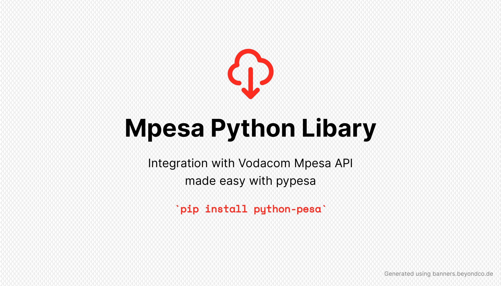

# [pypesa](http://kalebu.github.io/pypesa)

[](https://kalebu.github.io/pypesa/)
[](https://badge.fury.io/py/python-pesa)
[](https://github.com/Kalebu/pypesa)
[](https://pepy.tech/project/python-pesa)
[](https://pepy.tech/project/python-pesa)
[](https://pepy.tech/project/python-pesa)
[](https://opensource.org/licenses/MIT)


Python wrapper on **Mpesa public API** for mobile Payment Integration made with care to offer easy and elegant integration made by [kalebu](https://github.com/kalebu)


[](https://www.patreon.com/kalebujordan)

## Implemented Features

The following are the features that are supported by the **Mpesa** public API and require the **python** implementation.

- [x] Customer to Bussiness (C2B) Single Payment 
- [x] Bussiness to Customer (B2C)
- [x] Bussiness to Bussiness (B2B) 
- [x] Payment Reversal
- [x] Query Transaction status 
- [x] Direct debit creation and Payment


## Documentation 

Full documentation can be found on [pypesa](http://kalebu.github.io/pypesa)


## Getting started 

Getting started with **pypesa** is pretty straight forward and can be categorized 

into steps shown below.

- Sign up for Mpesa Developer portal 

- Install the [pypesa](http://kalebu.github.io/pypesa) package using **pip**

- Build your services with **pypesa**


## Signing up 

To sign up for Mpesa public API visit [Mpesa-API](https://openapiportal.m-pesa.com/sign-up) and then 

you can go through [getting started Mpesa Developer portal](https://dev.to/alphaolomi/getting-started-with-mpesa-developer-portal-46a4) 
by [alphaolomi](https://github.com/alphaolomi) to see how.

## Installation 

To install the **pypesa** package to your machine you can either 

install directly from github or use pip to install it.

- Using github

```bash
$~ git clone https://github.com/Kalebu/pypesa
$~ cd pypesa
$ pypesa ~ python setup.py install 
```

- Using pip

```bash

pip install python-pesa

```

## Usage

To begin using the package is pretty straight forward 

1. You need to have a json file named **keys.json** on your project directly 
  and then fill put in it your public and api keys in json format shown below 

  ```python

    {
     'api_key': 'xxx', 
     'public_key': 'xxxxxxxxxxxxxx' 
    }
  ```

2.Once done you're ready to go, just make sure you have active internet connection

### Example of Usage (Customer to Bussiness Transaction)

```python
>>> import pypesa
>>> mpesa = pypesa()
>>> transaction_query = {"input_Amount": "10", 
                        "input_Country": "TZN", 
                        "input_Currency": "TZS", 
                        "input_CustomerMSISDN": "000000000001", 
                        "input_ServiceProviderCode": "000000", 
                        "input_ThirdPartyConversationID":'2edf7a0206d848f6b6fedea26accdc3a', 
                        "input_TransactionReference": 'T23434ZE5',
                        "input_PurchasedItemsDesc": "Python Book"
}
>>> mpesa.customer_to_bussiness(transaction_query)

Request processed successfully   INS-0
{'output_ResponseCode': 'INS-0', 'output_ResponseDesc': 'Request processed successfully',
 'output_TransactionID': 'uGnPxFoXT2W0', 'output_ConversationID': '1d1e38495dc946729a8cffb136ab8391', 'output_ThirdPartyConversationID': '2edf7a0206d848f6b6fedea26accdc3a'}

```

### Naming the authentication json

If you named your authentication json in other name than **keys** you might to 
specify it while creating an instance for mpesa just as shown below;

```python
>>> import pypesa
>>> mpesa = pypesa(auth_path = filename)
``` 

## production environmnent

The package run by default using sandbox environmnent, If you wanna use it to real production
environmnent you can specify it while creating an instance as shown below 

```python
>>> import pypesa
>>> mpesa = pypesa(environmnent="production")
```

## To do list 

- [x] Adding a well structured documentation
- [] Adding a detailed test case to the implementation 
- [] Fixing rising bugs 

## Contributing 

Wanna contribute to Pypesa ? then please [contributing.md](https://github.com/Kalebu/pypesa/blob/main/Contributing.md) to see how 

## Give it a star

If you found this repository useful, give it a star, You can also keep in touch with on [twitter](https://twitter.com/j_kalebu).

## Bug bounty?

If you encounter **issue** with the usage of the package, feel free raise an **issue** so as 
we can fix it as soon as possible(ASAP) or just reach me directly through my email isaackeinstein(at)gmail.com

## Credit

All the credits to [kalebu](https://github.com/Kalebu/) and all the future contributors